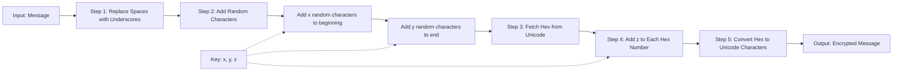

```mermaid
flowchart LR;
    K["Key: x, y, z"];
    A["Input: Message"] --> B["Step 1: Replace Spaces with Underscores"];
    B --> C["Step 2: Add Random Characters"];
    C --> C1["Add x random characters to beginning"];
    C1 --> C2["Add y random characters to end"];
    C2 --> D["Step 3: Fetch Hex from Unicode"];
    D --> E["Step 4: Add z to Each Hex Number"];
    E --> F["Step 5: Convert Hex to Unicode Characters"];
    F --> G["Output: Encrypted Message"];
    K -.-> C1;
    K -.-> C2;
    K -.-> E;
```
